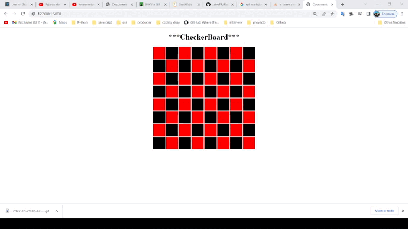

#   Flask: Patio de juegos

## Contenido
~~~
    Proyecto Flask que muestra un tablero de ajedrez en donde se puede modificar
    las filas, columnas y colores pasandole los valores por las rutas. 
~~~

     Escribir las siguientes rutas: 

    -  http://127.0.0.1:5000    ==> Muestra un tablero de 8 x 8
    -  http://127.0.0.1:5000/4 ==> Muestra un tablero de 8 x 4
    -  http://127.0.0.1:5000/(c)/(f) ==> Muestra un tablero de c x f
    -  http://127.0.0.1:5000/(c)/(f)/(color1)/(color2) ==> Muestra un tablero de c x f 
       y colores alternados.
    
  

## **Instalacion y configuracion**

#### Instalar un entorno virtual con  pipenv en forma global (omitir si ya está instalado):      
#### Window:
    pip install pipenv

#### Mac:
    pip3 install pipenv

#### Clona el repositorio del proyecto: 

    $ git clone https://github.com/JairoFR/Flask_tablero_ajedrez.git
    $ cd Flask_tablero_ajedrez

####  Instala desde Pipfile los paquetes que vienen configurados: 
    $ pipenv install

####  Activa el shell de Pipenv:
    $ pipenv shell

####  Detiene  el ambiente virtual en la terminal:
    $ exit

### Abrir proyecto en un editor de codigo fuente

    1.- Abrir proyecto en visual studio code.
    2.- Ir a Python: select interpreter ctrl+shift+p.
    3.- Seleccionar el ambiente virtual creado con el nombre de la carpeta.
    4.- Abrir nueva terminal y escribir python servidor.py
    5.- Escribir rutas especificadas en Seccion contenido.
